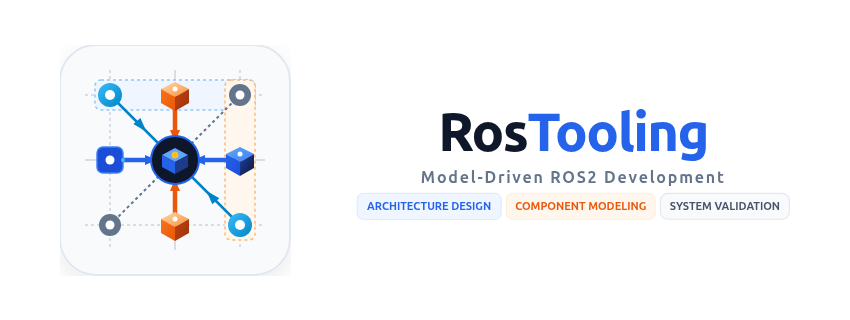

# RosTooling Languages for Visual Studio Code



A comprehensive Visual Studio Code extension providing model-driven software engineering support for the [RosTooling](https://github.com/ipa320/RosTooling) domain-specific languages: **ROS** (`.ros`), **ROS 1** (`.ros1`), **ROS 2** (`.ros2`), and **ROS System** (`.rossystem`).

This extension provides both an Eclipse Xtext-powered Language Server for text-based editing and the **RosTooling Studio**—an interactive visual diagramming and system architecture editor built right into VS Code.

---

## Features

### 🎨 RosTooling Studio (Visual Diagram Editor)
Open any RosTooling model in an interactive, visual editor with specialized views:

* **System Architecture View (`.rossystem`)**:
  * Assemble multi-node systems and nested subsystems on an infinite canvas with smooth zoom and pan.
  * Drag-to-connect wires between ports with real-time orientation and port compatibility validation (matching communication types and kinds).
  * Collapse and expand subsystem frames to structure large architectures cleanly.
  * Inspector panel for setting launch parameter overrides, remapping topic/service/action names, and linking to component definitions.
  * Add existing workspace nodes and catalogue components directly onto the canvas.
* **Component View (`.ros2` / `.ros1`)**:
  * Visual node component cards displaying all interfaces and parameters.
  * Add and edit Publishers, Subscribers, Service Servers/Clients, Action Servers/Clients, and Parameters.
  * Comprehensive **Quality of Service (QoS)** configuration: dropdown selectors for Reliability, Durability, History, Depth, Liveliness, Lease Duration, and Deadline with automatic YAML/DSL serialization.
* **Communication Objects View (`.ros`)**:
  * UML Type Schema cards for Messages, Services, and Actions.
  * Interactive type dependency connections and clean grammar synchronization.
* **Bi-directional Synchronization**:
  * All visual manipulations directly update the underlying `.rossystem`, `.ros2`, and `.ros` DSL files in real time.
  * Changes to node definitions automatically cascade to update subsystem views in open system models.

### 💡 Language Server & Code Intelligence
* **Code Completion (`Ctrl+Space`)**: Content assist for packages, artifacts, interfaces, message types, and parameters.
* **Syntax Highlighting**: Comprehensive grammar colorization and bracket matching.
* **Semantic Diagnostics**: Real-time validation, syntax error detection, and unresolved reference reporting backed by the Eclipse Xtext RosLanguageServer.

### 📚 Catalogue Model Management
* Dynamic indexing of the [RosModelsCatalog](https://github.com/ipa-nhg/RosModelsCatalog) and [RosCommonObjects](https://github.com/ipa320/RosCommonObjects) libraries.
* Reusable robot arms, sensors, drivers, and standard message packages available out-of-the-box.
* Core catalogue read-only enforcement with visual status badges to safeguard standard models.

### ⚙️ ROS 2 Package Generation & Build
* **ROS 2 Code Generation**: Generate complete ROS 2 C++/Python packages, CMakeLists, package.xml, and launch scripts directly from `.rossystem` models.
* **ROS 2 Package Build**: Trigger `colcon build` commands for generated packages via the Command Palette.

---

## Installation

### Method 1: Install Pre-packaged VSIX from GitHub Releases (Recommended)

Packaged `.vsix` releases are distributed through the project's GitHub Releases.

1. **Download the Extension Package**:
   Head to the [GitHub Releases](https://github.com/ipa-esa/RosTooling_Extension/releases) page and download the latest `rostooling-languages-<version>.vsix` file.

2. **Install the VSIX into VS Code**:
   You can install the downloaded file using any of the following methods:

   * **Option A: Via the Extensions View in VS Code (Easiest)**
     1. Open Visual Studio Code.
     2. Open the Extensions sidebar (`Ctrl+Shift+X` on Linux/Windows, `Cmd+Shift+X` on macOS).
     3. Click the **`...`** (Views and More Actions) menu in the top-right corner of the Extensions panel.
     4. Select **Install from VSIX...**.
     5. Select the downloaded `rostooling-languages-<version>.vsix` file and confirm.

   * **Option B: Via the Command Palette**
     1. Press `Ctrl+Shift+P` (or `Cmd+Shift+P` on macOS) to open the Command Palette.
     2. Type `Extensions: Install from VSIX...` and select the command.
     3. Locate and select the downloaded `.vsix` file.

   * **Option C: Via the Terminal / CLI**
     Run the following command in your terminal:
     ```bash
     code --install-extension rostooling-languages-<version>.vsix
     ```

---

### Method 2: Build from Source

For developers who want to modify or contribute to the extension:

1. Clone the repository:
   ```bash
   git clone https://github.com/ipa-esa/RosTooling_Extension.git
   cd RosTooling_Extension
   ```
2. Build the fat JAR and install into your local VS Code instance:
   ```bash
   ./gradlew installExtension
   ```

---

## How to Use

1. **Open RosTooling Studio**:
   * Right-click any `.rossystem`, `.ros2`, `.ros1`, or `.ros` file in the File Explorer or editor title bar and click **"Open in RosTooling Visual Studio"**.
   * Or click the graph icon (`$(graph)`) located in the editor tab toolbar.
   * Or run `RosTooling: Open in RosTooling Visual Studio` from the Command Palette (`Ctrl+Shift+P`).
2. **Generate ROS 2 Packages**:
   * Click the **Generate ROS 2 Package** button in the studio toolbar, or run `ROSSYSTEM: Generate ROS 2 Package` from the Command Palette.
3. **Build Packages**:
   * Run `ROSSDL: Build ROS 2 Package` from the Command Palette.

---

## Contributed Commands

| Command | Category | Description |
|---|---|---|
| `rostooling.openVisualStudio` | RosTooling | Opens the active RosTooling model in RosTooling Studio |
| `rossystem.triggerCodeGeneration` | ROSSYSTEM | Generates a complete ROS 2 package from a `.rossystem` model |
| `rossdl.buildPackage` | ROSSDL | Builds the generated ROS 2 package using `colcon` |

---

## Extension Settings

| Setting | Description | Default |
|---|---|---|
| `rostooling-languages.java.home` | Absolute path to the JDK 21+ installation directory. Leave empty to use system default Java. | `""` |
| `rostooling-languages.server.trace` | Verbosity of the language server trace output (`off`, `messages`, `verbose`). | `"off"` |

---

## Requirements

* **Visual Studio Code**: version 1.107.0 or later.
* **Java**: JDK 21 or later.
* **Operating System**: Linux (Ubuntu 22.04 LTS or later recommended) or macOS.

---

## Release Notes

### 2.0.0
* **RosTooling Studio**: Interactive visual diagram editor for `.rossystem`, `.ros2`, `.ros1`, and `.ros` DSLs.
* **Visual Architecture Assembly**: Drag-and-drop system modeling, interactive wire routing, port compatibility verification, and collapsible subsystems.
* **Quality of Service (QoS)**: Dropdown selectors for QoS profiles (Reliability, Durability, History, Depth, Liveliness, Lease Duration, Deadline) with compliant YAML/DSL serialization.
* **UML Type Schemas**: Visual representation of `.ros` communication objects and cross-type dependencies.
* **Catalogue Integration**: Dynamic indexing and discovery for `RosModelsCatalog` and `RosCommonObjects` with core catalogue read-only protection.
* **Dynamic Node Sync**: Real-time synchronization between companion `.ros2` and `.rossystem` artifacts.
* **Automated CI & Test Suite**: 109 unit, integration, and LSP protocol tests running on GitHub Actions CI.

### 1.1.0
* Added ROS 2 package generation feature directly from `.rossystem` models via the Command Palette.

### 1.0.1
* Fixed extension versioning to read dynamically from `package.json`.

### 1.0.0
* Initial release of RosTooling language support extension with code completion, validation, and syntax highlighting for ROS, ROS1, ROS2, and ROSSYSTEM DSLs.
